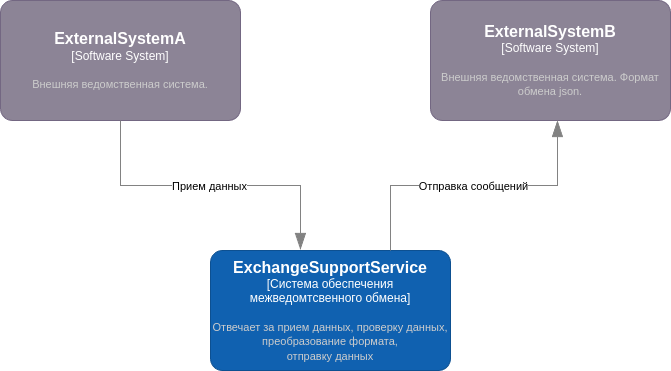
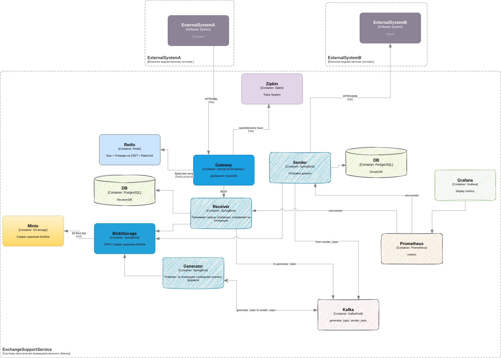
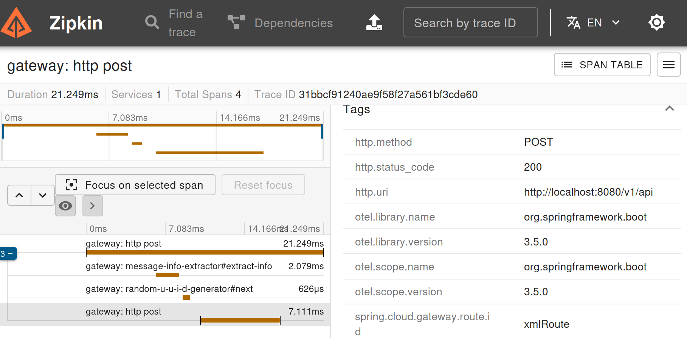
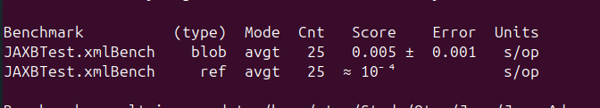
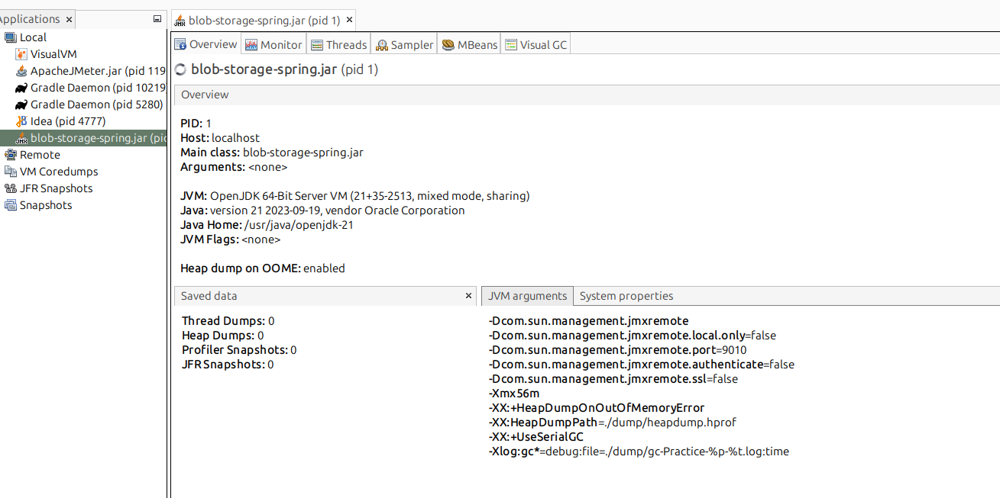
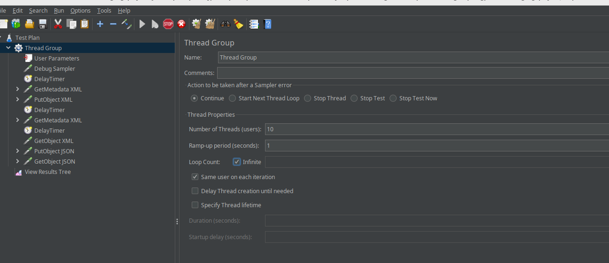
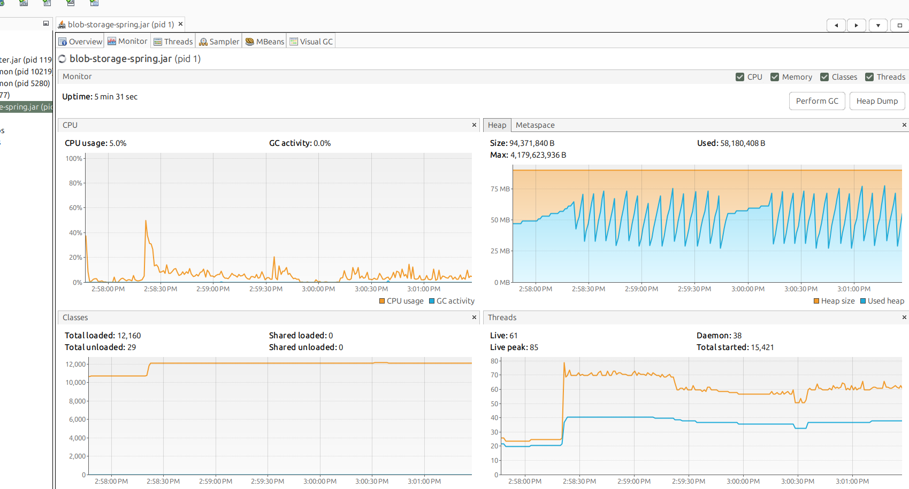
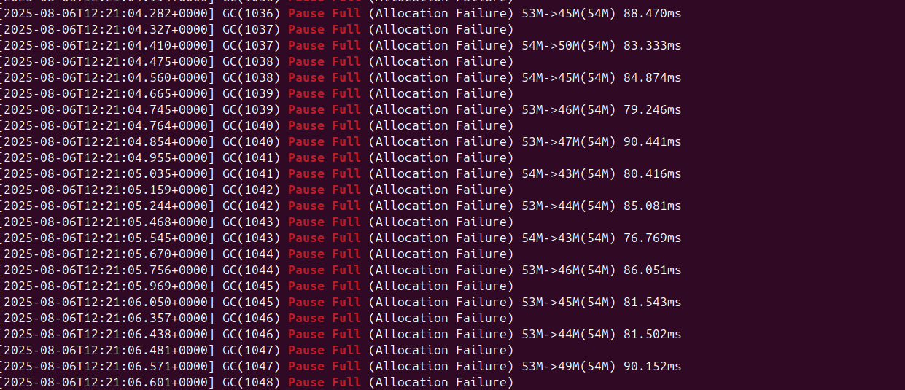
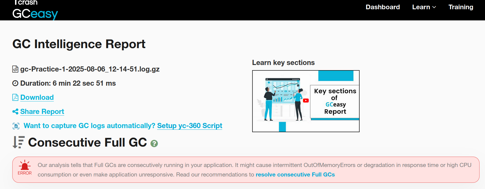
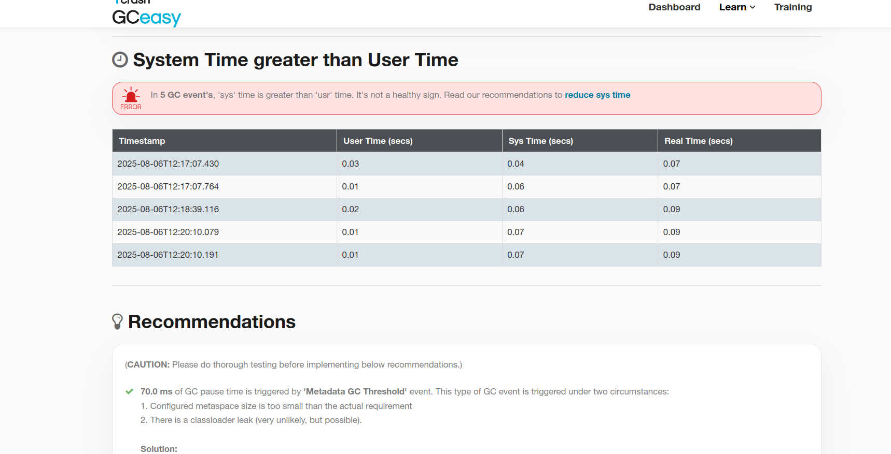

# Cервис поддержки обмена данными (data exchange support service)

## Преамбула

По работе занимаемся организацией межведомственного обмена, когда данные одного ведомства нужно передать в другое.
Такой обмен сопровождается:
- контролем входных данных (в случае, если канал связи недоверенный - проверка на вирусы, вложения, инъекции и т.д.; для всех - проверка формата сообщения, проверка электронной подписи в разных форматах)
- изменением формата данных (как правило, XML одного формата в XML другого формата; иногда json)
- отправка данных
- контролем доставки (проверка того, что на каждое отправленное в ведомство сообщение было подтверждение)
- отслеживанием состояния бизнес-процессов (когда сообщения поступают в рамках одного бизнес-процесса и нужно проверять правильность последовательности)

Некоторые особенности рабочей системы:
- размер сообщений от 10КБ до 50MБ (среднее 500 кб)
- размер сообщений обусловлен наличием бинарных данных (base64)
- нагрузка в пиках до 100 тыс/час
- сообщения имеют уникальные идентификаторы; при генерации нового сообщения, как правило, формируется новый идентификатор в соответствии с новым форматом
- ведомства могут присылать сообщения повторно; система должна вести себя идемпотентно (отправителю нужно вернуть OK, новых сообщений не формируется)
- принцип почты - ведомство получает подтверждение о доставке от Системы, а Система уже отвечает за доставку до другого ведомства
- проверки данных бывают достаточно ресурсоемкими, поэтому основная часть проверок проходит асинхронно; фактом приема в обработку является формирование служебного сообщения-подтверждения, а не HTTP 200/201.   
- есть время удаления бизнес-данных
- есть время удаления мета-данных

## Описание проекта (возможны корректировки)

В проекте разрабатывается система обмена данными. Для простоты считаем что одна внешняя система присылает XML, 
другая принимает JSON.

Будет реализовано пять java-сервисов: GateWay, Receiver, BlobStorage, Generator, Sender, а так же использованы ряд 
готовых контейнеров.

**Прим**. Применяю подход, которые мы сейчас используем в проде:
Раздельная обработка обычных данных и бинарных - бинарные данные лежат в отдельном хранилище, в БД лежат только обычные 
данные и ссылки на блобы. В сообщения при хранении вставляются base64(ссылка_блоб). В качестве ссылок применяем 
хэш. Блобы подгружаются только когда они реально необходимы. С точки зрения прикладного софта(а также XML/JSON декодеров) 
ему нет разницы - реальный ли это блоб или ссылка.

[Описание работы с блобами](docs/adr/002-blob-references.md)

## gateway 
SpringCloudGateway reactive - сервис. Принимает данные, от внешней системы по определенном ендпоинту, делает проверу, 
добавляет processId и роутит их на Receiver. 

Фильтры:
- RPM 10/min (RequestRateLimiter gateway filter cluster на redis) 
- CircuitBreaker (resilience4j)
- Кастомный фильтр (добавляет заголовки)
- Кастомный фильтр (проверяет входной xml)

### Используемые навыки:
1. 14 - Разбор JMeter и организация нагрузочного тестирования (gateway-service/gateway-jmeter.jmx, blob-storage-service/blob-storage-spring/blob-stroage-grpc.jmx). 
2. 23 - Реактивное программирование: Профилирование приложения на Reactor  (ValidateInputXMLGatewayFilterFactory.apply - onSuccess, onError)
4. 30 - Сквозное логирование в микросервисах. (opentelemetry) 
5. 31 - Проектирование и архитектура в разрезе микросервисов (API Gateway)
6. 37 - Шаблоны проектирования отказоустойчивого сервиса (Resilience4j CircuitBreaker) (application.yaml)

[Описание настроек для gateway](docs/adr/001-gateway-hints.md)

## models
Содержит DTO-модели (jaxb, json) + jmh - тесты

### Используемые навыки:
1. 13 - Разбор библиотеки Java Microbenchmark Harness

## jfr-image
Содержит python-сервис для снятия jfr с работающего контейнера + сборка урезанной под сервис jre + cmd.

подробности [jfr](docs/adr/003-jfr-docker.md)

### Используемые навыки:
1. 11 - JDK tools
2. 18 - Профилирование java приложений. Thread dump, JFR

## blob-storage
java - GRPC + openapi (specification first) сервис, отвечающий за хранение бинарных данных (блобы и тела сообщений) по 
принципу key-value хранилище, где key - ключ вида $processGUID/blob_hash.

Особенности рализации:
1. S3 - как основное (планирую для простоты minio)
2. SoftReference - внутренни кэш
[Реализация кэша](docs/adr/005-objects-in-memory.md)

### Используемые навыки:
1. 3 - Java Instrumentation & Java agent [006-reactor-blockhound](docs/adr/006-reactor-blockhound.md)
2. 4 -  Memory management. JVM memory structure  (GenericCache.java, MemorySyncStorage.java)
3. 15 - Java.util.concurrent. Atomics, ConcurrentHashMap, ConcurrentSkipListMap (FutureStorage.java)
4. 16 - Java.util.concurrent. Locks, ReadWriteLock, ReentrantLock (GenericCache.java)
5. 17 - Java.util.concurrent. CountDownLatch, Semaphore, Phaser (FutureStorage.java)
6. 21 - Java NIO (работаю с ByteBuffer; под капотом netty; docs/adr/005-objects-in-memory.md;)
7. 22 - Реактивное программирование: Reactor (весь модуль)
8. 34 - Protobuf, gRPC

## memory-dump
Содержит Dockerfile и compose для запуска сервиса blob-storage с возможностью подключения по jmx (VisualVM). Запускаю, 
даю нагрузку blob-storage-service/blob-storage-spring/blob-stroage-grpc.jmx ну и можно подключаться и анализировать.

### Выводы:
1. Приложение не упало
2. Работа FullGC  - в принципе видно, что паузы достаточно маленькие но их моного
3. gceasy тоже ругается на FullGC и что очень много OutOfMemoryErrors - но текущая реализация на SoftReference!!

Инструменты для анализа есть - дальше можно анализировать работу приложения с WeakReference, ByteBuffer.allocateDirect 
и тюнингом GC,

### Используемые навыки:
1. 5 - Memory management. Разбор алгоритмов GC: SerialGC, ParallelGC, CMS GC
2. 7 - Memory dump
3. 19 - Профилирование java приложений. Работа с jvisualvm & asyncProfiler

## Receiver
java - REST-сервис. (reactor + swagger)

Синхронно:
- извлекает из сообщения идентификатор сообщения, код ведомства (классификатор), тип сообщения(классификатор) (по QName какого-нибудь элемента)
- проверяет возможность использования данного типа сообщения для ведомства
- проверяет по БД не дубликат ли это (далее для трассировки будет использоваться processGUID равный processId, или, если дубликат, будет использоваться существующий processGUID (сообщение может залететь повторно))
- извлекает блобы из сообщения, заменив их ссылками на блоб (хэш от данных MurmurHash) и раздельно сохраняет блобы и сообщение со ссылками в BlobStorage по пути ${processGUID}/имя_файла
- отправляет в ZSET в редисе в виде base64url(processGUID, messageID, messageType) для дальнейшей асинхронной обработки

Метрики: 
- cpu/ram
- кол-во отказов в обработке из-за некорректного типа/неизвестного кода ведомства
- grpc pool
- redis pool
- database pool

Траселог:
- прием сообщений, работа с processId(новое сообщение/существующее), обращение к БД и BlobStorage (интересуют события по processGUID), отправка в redis

## Generator
java - сервис, отвечающий за генерацию json в зависимости от типа переданного сообщения. Генерирует новый идентификатор сообщения (считаем что формат messageID меняется вместе с форматом сообщения).

(jmh - можно помереть генерацию json freemarker, jackson или gson; с блобами и без)

- извлекает из ZSET сообщение в виде base64url(processGUID, messageID, messageType) 
- по processGUID и messagID извлекает XML по messageID
- по messageType восстанавливает соответствующий jaxb-объект, маппит его в нужный DO, который преобразует в json; для json генерирует новый идентификатор
- json сохраняет в хранилище, в БД сохраняет соответствие messageID и jsonId. Если данные в БД уже были(пришёл повтор) - то ничего нового не генерируем (Идемпотентность !!) 
- отправляет в ZSET сообщение в вида base64url(processGUID, jsonID, receiverDepartmentCode)

Траселог:
- прием сообщений/отправка сообщений через redis, чтение/запись из BlobStorage, генерация

Актуатор: 
- включение - отключение генерации через отключение прослушивания ZSET; хотелось бы реализовать получение сигналов из kafka

## OutWay
java - сервис, отвечающий за отправку данных.

- извлекает из ZSET сообщение в виде base64url(processGUID, jsonID, receiverDepartmentCode)
- вносит в БД данные об отправке
- по шедулеру определяет то, что нужно отправить, определяет url по receiverDepartmentCode, восстанавливает полный json и отправляет данные (select for update skip locked)

Траселог:
- прием запросов на отправку через redis
- отправка данных

Метрики:
- кол-во отправок по url
- скорость отправки данных (rpm)
- кол-во ошибок при отправках по url

Актуатор:
- включение/отключение отправки на данный департамент через kafka

# Дополнения
- есть желание добавить в базовые контейнеры добавить возможность получения результата работы jcmd по снятию jfr для целевого процесса
- для отладки работы предполагается использовать docker-compose/для развертывания облако на yandex-cloud

