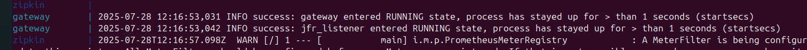
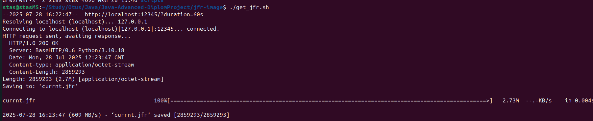
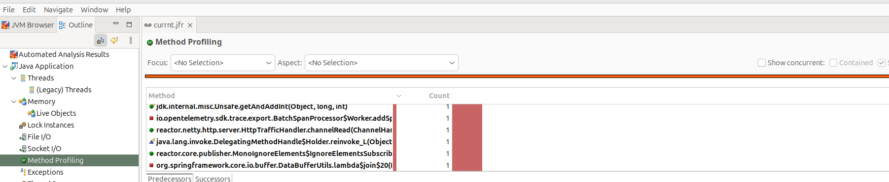

# Проблема
Необходимо снимать jfr с работающего контейнера

# Решение
Написал небольшой python-сервис, который работает вместе с целевым java-приложением и вызывает jcmd.
Сервис добавляется в docker. (см jfr-image)

Образ создаю на базе python:3.10.
Для управления процессами использую supervisord.

Так как в стандартной jre нет jcmd, собираю собственную сборку jre на базе openjdk 21.

Вылезла проблема, что для spring-приложения jdeps build/gateway-service.jar показывает не все необходимые модули.

Для проверки все ли хватет добавил скрипт check_jre_build.sh. Для поиска нужного модуля - добавил java-проект jfr-image:helper.
То есть если check_jre_build.sh. показывает что, например, :
```
Caused by: java.lang.NoClassDefFoundError: javax/management/NotificationListener
```

То можно вызвать 

```
jfr-image/helper$ ./find_module.sh javax/management/NotificationListener

> Task :jfr-image:helper:run
java.management
```

и увидель что не хватает модуля java.management.

Итерационно нашел что нужно добавить к jdk.jcmd,java.base ещё и java.logging,java.desktop,java.management,jdk.unsupported.

Модуль jdk.jfr вылез при выполнении jcmd в конктейнере.

Для получения jfr из контейнера использую скрипт get_jfr.sh

# Результаты
- контейнер поднимается

- jfr можно вытащить

- и открыть в jcmd
 

